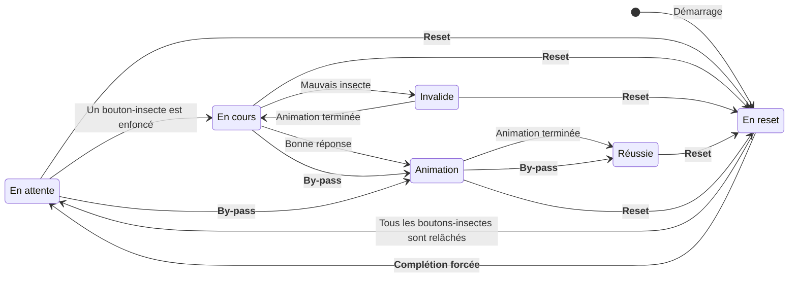

Chamanik est un jeu d'évasion offert par [Escaparium Sherbrooke](https://www.escaparium.ca/sherbrooke).
Il met de l'avant une expérience non-linéaire composée de plusieurs énigmes diverses: certaines sont purement mécaniques, d'autres basées sur la logique ou encore les talents d'observation.

Surtout, la quasi-totalité des énigmes de Chamanik ont une **composante électronique**.

Du point de vue du **joueur**, cet aspect contribue énormément à l'effet d'immersion et _magique_ d'un jeu d'évasion. 
Du point de vue du **maître de jeu**, ce même aspect est une source de complexité énorme.

En effet, une énigme électronique est plus complexe qu'un cadenas, est plus sujette aux instabilités, nécessite l'utilisation de capteurs parfois imprécis, requiert une plus grande intégration avec tous les autres éléments présents dans une salle et comporte une composante _invisible_ pour le maître de jeu.

Mais surtout, c'est un **couteau à double tranchant**. 
Une énigme électronique stable et fonctionnelle rend l'expérience plus agréable pour tous. 
Une énigme électronique instable nuit à l'expérience.

Les mots d'ordre sont donc **fiabilité** et **stabilité**.

J'ai eu la chance de participer au processus d'amélioration de Chamanik afin de rencontrer cette vision.

## Objectifs

Mes objectifs se découpent en deux parties distinctes: du point de vue du joueur et du point de vue du maître de jeu.

| Point de vue du joueur                                                                                                                      | Point de vue du maître de jeu                                                                                                                                                                                                                                        |
| ------------------------------------------------------------------------------------------------------------------------------------------- | -------------------------------------------------------------------------------------------------------------------------------------------------------------------------------------------------------------------------------------------------------------------- |
| - Les énigmes électroniques détectent les interactions et fonctionnent rapidement. - Leur comportement est compréhensible et répétable. | - Les énigmes électroniques ont un comportement prévisible. - Elles fonctionnent automatiquement. - Elles fournissent les outils nécessaires pour être contrôlées manuellement. - Leur états internes sont compréhensibles et disponibles en temps réel. |

Dans les deux cas, la fiabilité et la stabilité sont mises de l'avant.

## Stratégies

J'ai mis en place plusieurs stratégies pour stabiliser Chamanik.

| Objectif                                                   | Stratégies                                                                                                                                                                                                                                               |
| ---------------------------------------------------------- | -------------------------------------------------------------------------------------------------------------------------------------------------------------------------------------------------------------------------------------------------------- |
| Stabiliser le comportement des énigmes                     | - Rédiger les attentes sous forme de requis fonctionnels - Décrire clairement et d'une manière déclarative les comportements souhaités - Élaborer les plans de conception en amont                                                               |
| Fiabiliser les énigmes                                     | - Élaborer un processus de test rigoureux - Mettre en place des stratégies de régression - Comparer aux requis et plans élaborés précédemment                                                                                                    |
| Rendre l'état interne des énigmes disponible en temps réel | - Utiliser une technologie appropriée au transfert d'information m:n en temps réel (MQTT) - Transmettre le minimum d'information possible en minimisant l'entropie - Utiliser les forces des différents appareils technologiques à leur avantage |

## Objectif: Stabiliser le comportement des énigmes

En prenant le temps de déterminer quel est le comportement souhaité d'une énigme avant de la modifier, il est facile de déterminer quels éléments découlent de quelle situation.

Ainsi, le système passe de **plusieurs éléments à synchroniser** à un espace où les éléments sont **décrits en fonction du progrès du joueur**.

### Requis fonctionnels

En guise d'exemple, voici un extrait des requis fonctionnels rédigés pour la "toile d'araignée".

- ...
- En tout temps, la toile d'araignée détecte lorsqu'un bouton-insecte est enfoncé.
- En tout temps, la toile d'araignée détecte lorsqu'un bouton-insecte est relâché.
- La toile d'araignée considère un insecte comme saisi lorsque le bouton-insecte devient enfoncé (_on button down_).
- Lorsque la toile d'araignée est `en cours`, elle évalue si un insecte est valide lorsqu'il est saisi.
- La toile d'araignée considère un insecte `valide` s'il est le prochain dans la séquence.
- Si un insecte est `valide`, la toile d'araignée avance dans la séquence.
- Lorsque la toile d'araignée est `invalide`, elle recule jusqu'au dernier insecte `verouillé`. Pour ce faire, elle éteint graduellement tous les insectes `valide`s dans l'ordre inverse de la séquence.
- Lorsque la toile d'araignée est `invalide` vis-à-vis un insecte `verouillé`, elle ne fait rien et redevient `en cours`.
- ...

### Diagramme d'états

Ces requis se réfèrent au diagramme d'états exprimant le comportement de l'énigme.
Le comportement de tous les accessoires s'y base.

Le schéma indique également le contrôle offert aux maîtres de jeu: toutes les transitions en **gras** peuvent être activées manuellement à distance. 
Ceci permet alors un contrôle fin sur une énigme qui est parallèle à son comportement automatique (transitions régulières).

## Objectif: Rendre l'état interne des énigmes disponible en temps réel

Initialement, les états internes des énigmes étaient récupérés via HTTP avec un modèle de _polling_, une énigme à la fois. 
Cette solution ne permettait pas d'avoir toutes les données les plus récentes instantanément et introduisait une charge non-nécessaire sur le système. 
En effet, **toutes les énigmes avaient un double rôle**: gérer leur énigme et agir en tant que serveur web.

_Modèle de polling_

L'objectif a été atteint en réorganisant la structure du réseau.

Toutes les énigmes n'ont plus qu'un rôle: être une énigme.
Elles sont connectées à un broker MQTT local afin d'y publier tout changement à leur état.
Ce comportement a pour avantage d'être très rapide: les données sont disponibles en temps réel sur le broker.
De plus, seuls les changements sont transmis.
La charge est donc nettement moindre pour les microcontrôleurs utilisés puisqu'ils ont moins de données à transmettre sur le réseau, moins souvent.

Les maîtres de jeu quant à eux contactent un serveur web local afin d'avoir accès au panneau de contrôle. 
Celui-ci est également connecté au broker et affiche l'état de Chamanik en temps réel à l'aide d'une application web moderne.

Cette architecture a le net avantage d'utiliser le bon outil pour effectuer le bon travail.
Le tableau suivant présente un résumé des outils utilisés.

| Outil                              | Environnement                   | Fonctionnalité                                                                           | Besoin                                                                                 |
| ---------------------------------- | ------------------------------- | ---------------------------------------------------------------------------------------- | -------------------------------------------------------------------------------------- |
| Microcontrôleur                    | Embarqué, spécifique au besoin  | Contrôler les énigmes, interfacer avec les capteurs, produire une expérience immersive   | Aucune latence                                                                         |
| Broker MQTT                        | Machine dédiée et robuste       | Gérer les souscriptions et publications MQTT, _scaling_ horizontal                       | Isolation des composantes, fiabilité                                                   |
| Serveur web                        | Machine dédiée et robuste       | Fournir la version à jour du panneau de contrôle                                         | Rendre le panneau de contrôle accessible sur n'importe quel appareil au sein du réseau |
| Panneau de contrôle (page web) | Navigateur web, appareil mobile | Donner une visibilité claire sur l'état de Chamanik et en fournir le contrôle nécessaire | Interface claire qui se met à jour rapidement et facilement                            |

Bien que simples, les vidéos suivantes présentent la différence entre les deux architectures. 
Dans les deux cas, si une bûche est bien orientée (selon l'image), l'énigme émet deux _feedbacks_: la bûche est illuminée et un son est joué. 
Ces comportements sont immédiats puisque c'est le rôle principal du microcontrôleur en charge. 
Le tableau de bord quant à lui affiche quelles bûches sont bien orientées (dans la vidéo, ce sont les bûches 2 et 5 qui sont modifiées). 
Dans le cas du _polling_, les changements sont lents et ne permettent pas de bien refléter l'état interne de l'énigme. 
Dans le cas de MQTT, les changements sont immédiats. Le tableau de bord est alors un bon outil pour suivre l'état de l'énigme.

_**NOTE**: Pour bien refléter une énigme, le tableau de bord devrait être mis à jour **au même moment que les effets sonores et visuels**._

|                                     Architecture _polling_                                     |                                    Architecture MQTT                                     |
| :--------------------------------------------------------------------------------------------: | :--------------------------------------------------------------------------------------: |
| <video controls muted><source src="/projects/chamanik/video-polling.mp4">Video polling</video> | <video controls muted><source src="/projects/chamanik/video-mqtt.mp4">Video MQTT</video> |

## Conclusion

Ceci ne représente qu'une infime partie du travail effectué pour améliorer Chamanik. 
Bien que parfois complexes, les problèmes soulevés ont tous pu être réglés d'une manière simple et élégante, rendant la salle stable et fiable. 
Un projet comme celui-ci est toujours passionnant!

