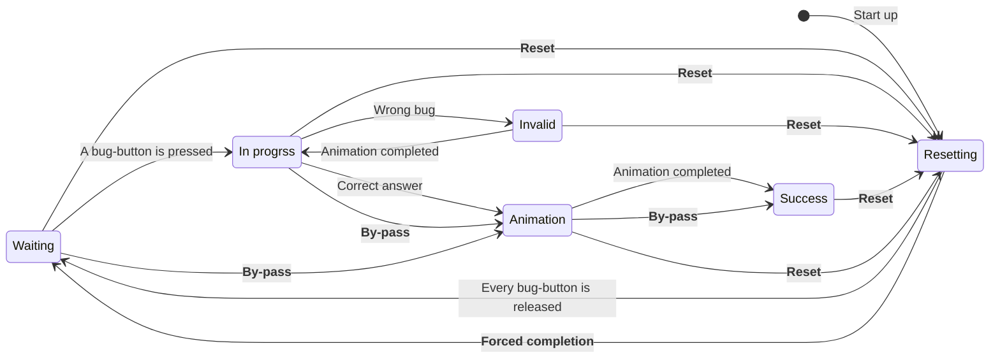

Chamanik is an escape game offered by [Escaparium Sherbrooke](https://www.escaparium.ca/sherbrooke).
It features a non-linear experience made up of a variety of puzzles: some are purely mechanical, others rely on logic or keen observation skills.

Above all, nearly every puzzle in Chamanik includes an electronic component.

From the **player**’s perspective, this aspect greatly enhances the immersive and _magical_ feel of an escape game. 
From the **game master**’s perspective, that same aspect becomes a significant source of complexity.

Indeed, an electronic puzzle is more complex than a padlock, more prone to instability, requires sensors that can sometimes be imprecise, demands deeper integration with all the other elements present in a room, and includes an invisible component for the game master.

But most of all, it is a **double-edged sword**. 
A stable, well-functioning electronic puzzle makes the experience more enjoyable for everyone. 
An unstable electronic puzzle detracts from the experience.

The guiding principles, therefore, are **reliability** and **stability**.

I had the opportunity to take part in the process of improving Chamanik in order to bring this vision to life.

## Objectives

My objectives are split in two distinct parts: the player's perspective and the game master's perspective.

| Player perspective                                                                                                       | Game master perspective                                                                                                                                                                                                              |
| ------------------------------------------------------------------------------------------------------------------------ | ------------------------------------------------------------------------------------------------------------------------------------------------------------------------------------------------------------------------------------ |
| - The electronic puzzles detect interactions and respond quickly. - Their behavior is understandable and repeatable. | - The electronic puzzles behave in a predictable way. - They operate automatically. - They provide the necessary tools to be controlled manually. - Their internal states are understandable and available in real time. |

In both cases, reliability and stability are brought forwards.

## Strategies

I set up many strategies to stabilize Chamanik.

| Objective                                      | Strategies                                                                                                                                                                             |
| ---------------------------------------------- | -------------------------------------------------------------------------------------------------------------------------------------------------------------------------------------- |
| Stabilize the puzzles' behavior                | - Write up the expected behavior as functional requirements - Clearly describe in a declarative manner the desired behaviors - Elaborated conception plans beforehand          |
| Make the puzzles reliable                      | - Elaborate a rigorous testing process - Set up regression strategies - Compare to the previously written requirements and plans                                               |
| Expose the internal puzzle states in real time | - Use an appropriate technology to send m:n data in real time (MQTT) - Minimize the data to be sent to minimize entropy - Use various technological devices to their strengths |

## Objective: Stabilize the puzzles' behavior

By taking the time to define the desired behavior of a puzzle before modifying it, it becomes easier to determine which elements stem from which situation.

In doing so, the system shifts from **multiple elements that need to be synchronized** to a space where elements are **described in terms of the player’s progress**.

### Functional requirements

As an example, here is an excerpt of the functional requirements written for the "web".

- ...
- At all times, the spider web detects when a bug-button is pressed.
- At all times, the spider web detects when a bug-button is released.
- The spider web considers a bug as captured when the bug-button becomes pressed (_on button down_).
- When the spider web is `in progress`, it evaluates whether a bug is valid when it is captured.
- The spider web considers a bug `valid` if it is the next one in the sequence.
- If a bug is `valid`, the spider web advances in the sequence.
- When the spider web is `invalid`, it steps back to the last `locked` bug. To do so, it gradually turns off all `valid` bugs in reverse sequence order.
- When the spider web is `invalid` with respect to a `locked` bug, it does nothing and returns to `in progress`.
- ...

### State diagram

These requirements refer to the state diagram describing the puzzle's behavior.
Every accessory's behavior is based on these states.

The diagram also indicates the control offered to the game masters: every transition in **bold** can be manually and remotely activated. 
This allows a fine control over a puzzle. This control is parallel to the puzzle's automatic behavior (regular transitions).

## Objective: Expose the internal puzzle states in real time

Initially, the internal states of the puzzles were retrieved over HTTP using a _polling_ model, one puzzle at a time. 
This approach did not give access to the most up-to-date data instantly and introduced unnecessary load on the system. 
Indeed, **every puzzle had a dual role**: managing its own logic and act as a web server.

_Polling model_

The objective was achieved by reorganizing the network architecture.

Each puzzle now has a single role: to be a puzzle.
They are connected to a local MQTT broker where they publish any state change.
This approach has the advantage of being very fast: data is available in real time on the broker.
In addition, only changes are transmitted; not the entire state.
The load is therefore significantly reduced for the microcontrollers, as they have less data to send over the network, and less often.

As for the game masters, they connect to a local web server to access the dashboard. 
This server is also connected to the broker and displays Chamanik’s state in real time using a modern web application.

This architecture brings the net advantage of using the correct tool for the job.
The following table shows a summary of the required tools.

| Tool                     | Environment                  | Function                                                               | Requirement                                                    |
| ------------------------ | ---------------------------- | ---------------------------------------------------------------------- | -------------------------------------------------------------- |
| Microcontroller          | Embedded, use-case specific  | Control puzzles, interact with sensors, create an immersive experience | No latency                                                     |
| MQTT Broker              | Dedicated and robust machine | Handle MQTT publications and subscriptions, horizontal scaling         | Component isolation, reliability                               |
| Web server               | Dedicated and robust machine | Send the up to date dashboard                                          | Enable any device on the local network to access the dashboard |
| Dashboard (web page) | Web browser, mobile devices  | Enable a good visibility on Chamanik's state and control the game      | Clear and fast user interface                                  |

Although simple, the following videos illustrate the difference between the two architectures. 
In both cases, when a log is correctly oriented (according to the image), the puzzle emits two feedbacks: the log lights up and a sound is played. 
These behaviors are immediate, since this is the primary role of the microcontroller in charge. 
The dashboard displays which logs are correctly oriented (in the video, logs 2 and 5 are being modified). 
With the polling approach, changes are slow and do not accurately reflect the internal state of the puzzle. 
With MQTT, changes are immediate. The dashboard then becomes an effective tool for tracking the puzzle’s state.

_**NOTE**: To properly reflect a puzzle, the dashboard should be updated **at the same time as the other visual and auditive feedback**._

|                                     _Polling_ architecture                                     |                                    MQTT architecture                                     |
| :--------------------------------------------------------------------------------------------: | :--------------------------------------------------------------------------------------: |
| <video controls muted><source src="/projects/chamanik/video-polling.mp4">Video polling</video> | <video controls muted><source src="/projects/chamanik/video-mqtt.mp4">Video MQTT</video> |

## Conclusion

This only show a small part of the work done to upgrade Chamanik. 
While sometimes complex, the problems we found could all be fixed in a simple and elegant manner, making the room more reliable and stable. 
A project like this one is always exciting!

